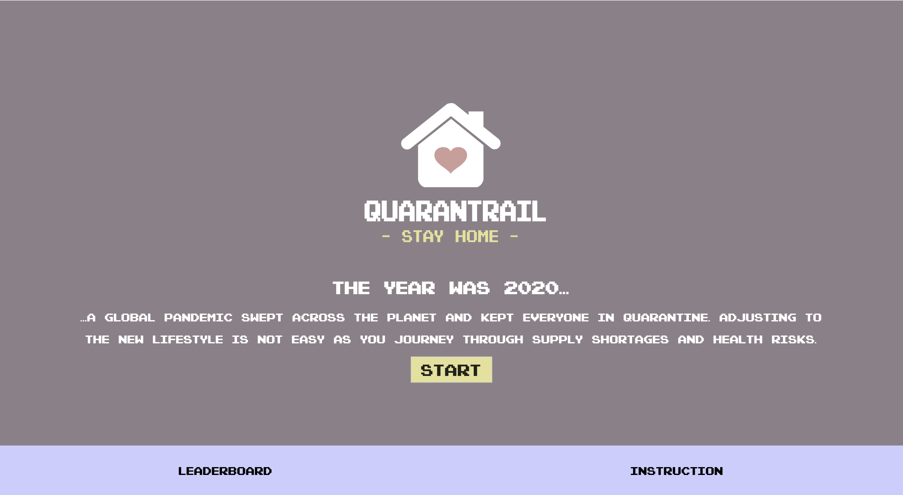
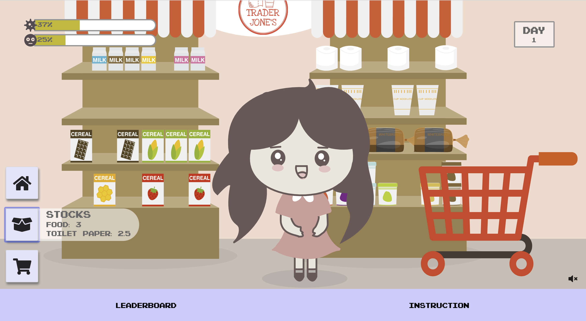
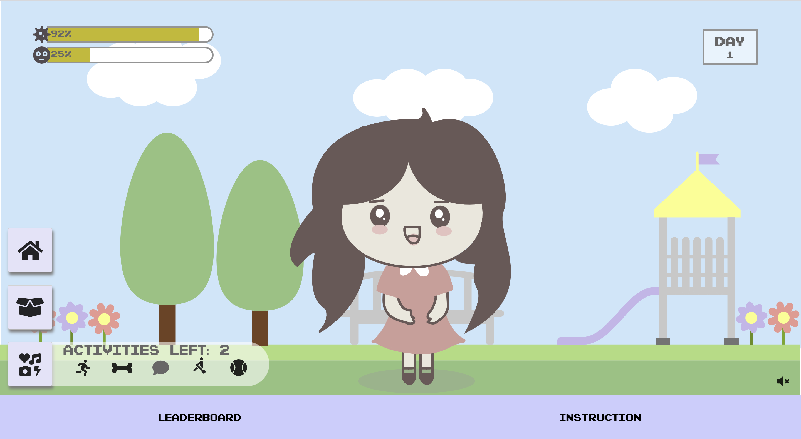

# QuaranTrail

## Written by QuaranTeam

- Nghi Tran
- Taylor Piccarreto
- Robert Perez
- Jaye Laguardia

## Live Link: [QuaranTrail](https://quarantrail.web.app/)

## API Repo Link: [Api Repo](https://github.com/nttran8/quarantrail-server)

### About

In this playful and lighthearted game, the world was struck with an awful pandemic and the player has to stay indoors. The goal is to practice social distancing and self quarantine while keeping one's boredom level bar low for as many days as possible. As such, the two guages to keep an eye on are the chance of infection and boredom. Every choice and action can increase or decrease these guages so tread carefully. The player must also need to keep track of, and maintain, their supply of food and toilet paper, but you may not want to get too much...

### Tech Stacks

- React
- Javascript
- HTML5
- CSS3
- Firebase
- React-Game-Engine

### Screenshots

